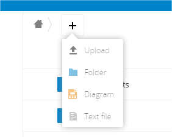
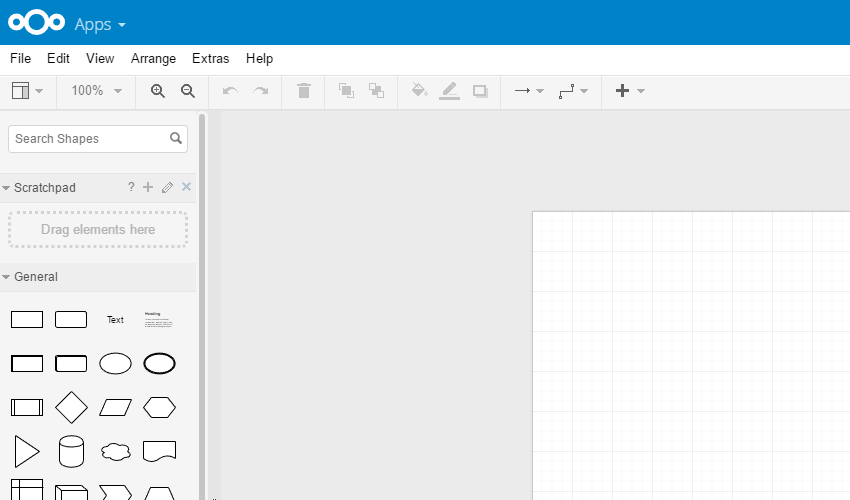
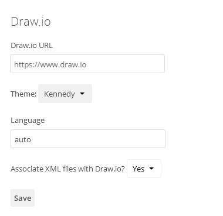

#  Nextcloud Draw.io integration app

This app allows users to create and edit diagrams in [Nextcloud](https://nextcloud.com) using [Draw.io](https://draw.io) on-line editor.

App Store link: https://apps.nextcloud.com/apps/drawio

Once installed, you will see an option to create a Draw.io diagram from the 'create file' menu.  Note: this app does not produce an app icon.

## Info ##
- Requires [Nextcloud](https://nextcloud.com) >11.0.0
- Multi language support (l10n)
- Inspired by the old Draw.io Integration and OnlyOffice
- Tested with Chrome 58-83 and Firefox 53-77
- Tested with PHP 5.6/7.1/7.3
- Draw.io Integration v0.9.6 tested with NextCloud 11.0.3 / 12.0.2 / 13.0.6 / 14.0.4 / 15.0.0 / 16.0.0 / 17.0.0 / 18.0.0 / 19.0.0

## Mimetype detection ##

Unfortunately, apps can't declare new mimetypes on the fly. To make
Draw.io work properly, you need to add a new mimetypes in the
`mimetypemapping.json` file (at Nextcloud level).

To proceed, just copy `/resources/config/mimetypemapping.dist.json` to
`/config/mimetypemapping.json` (in the `config/` folder at Nextcloud’s
root directory; the file should be stored next to the `config.php`
file). Afterwards add the two following line just after the “_comment”
lines.

    "drawio": ["application/x-drawio"],

If all other mimetypes are not working properly, just run the
following command:

    sudo -u www-data php occ files:scan --all

## Download ##
Current release: [zip](https://github.com/pawelrojek/nextcloud-drawio/releases/download/v.0.9.7/drawio-v0.9.7.zip) or [tar.gz](https://github.com/pawelrojek/nextcloud-drawio/releases/download/v.0.9.7/drawio-v0.9.7.tar.gz)

## Changelog ##

## 0.9.7
- Changed the default Draw.io URL to embed.diagrams.net (#119) (#118)

## 0.9.6
- Filename encoding problem (#108)
- NC19 compatibility
- Autosave (PR #90)
- Fixed content detection (PR #115)
- Fixed some translations (PR #112)

## v0.9.5
- NC18 compatibility

[Complete changelog](https://github.com/pawelrojek/nextcloud-drawio/blob/master/drawio/CHANGELOG.md)

## Installation ##
1. Copy Nextcloud draw.io integration app ("drawio" directory) to your Nextcloud server into the /apps/ directory
2. Go to Apps -> "+ Apps" > "Not Enabled" and _Enable_ the **Draw.io** application

## Known Issues ##
If you're experiencing problems while updating your Nextcloud intance, try to disable/delete Draw.io integration app (/apps/drawio/) and then install/copy it again after the NC update is completed.

## Configuration ##
Go to Admin page and change the settings you want:

Click "Save" when you're done.

If you would like to self-host Draw.io, you might want to consider https://github.com/jgraph/docker-drawio from the creators of Draw.io (now [diagrams.net](https://www.diagrams.net/)).

## License ##
- Released under the Affero General Public License version 3 or later.
- [CC 3.0 BY] File icon made by [DinosoftLabs](http://www.flaticon.com/authors/dinosoftlabs) / [Link](http://www.flaticon.com/free-icon/organization_348440)

## Contributors ##
- [geiseri](https://github.com/geiseri)
- [arnowelzel](https://github.com/arnowelzel)
- [schizophrene](https://github.com/schizophrene)
- [xlyz](https://github.com/xlyz)
- [cuthulino](https://github.com/cuthulino)
- [tavinus](https://github.com/tavinus)
- [LEDfan](https://github.com/LEDfan)
- [mario](https://github.com/mario)
- [ColdSphinX](https://github.com/ColdSphinX)
- [acidhunter](https://github.com/acidhunter)
- [janLo](https://github.com/janLo)
- [Irillit](https://github.com/Irillit/)

[View all](https://github.com/pawelrojek/nextcloud-drawio/graphs/contributors)

## Support ##
 * Any feedback and code is greatly appreciated!
 * It's all free, but please consider making a donation if you use it (and you can afford it) - it takes a lot of time to maintain/test/review/release. Thanks!

 
